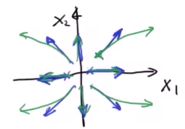
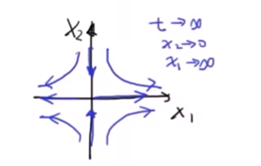
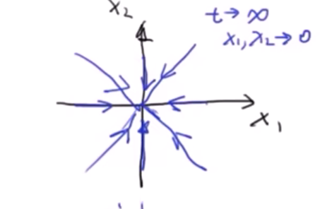

# PHASE PORTRAIT AND TRAJECTORY
# 相图 相轨迹
教程视频：https://www.bilibili.com/video/BV1ex411g7t3/?spm_id_from=333.788&vd_source=79f2249f524924ae622cbd2664a5848e

---
假设状态方程为：
$$
\begin{aligned}
\frac{dx}{dt}\begin{bmatrix}
x_1\\
x_2
\end{bmatrix} = 
\begin{bmatrix}
a & b\\
c & d
\end{bmatrix}
\begin{bmatrix}
x_1\\
x_2
\end{bmatrix}
\end{aligned}
$$
令$b = c =0$，则有：
$$
\begin{aligned}
\dot x_1 &= ax_1\\
\dot x_2 &= dx_2
\end{aligned}
$$
case1: Source 类型的相图$a > 0, d > 0$
<!-- 插入图片： -->

case2: Saddle 类型的相图$a > 0, d < 0$
<!-- 插入图片： -->

case3: Sink 类型的相图$a < 0, d < 0$
<!-- 插入图片： -->

---
Gneneral Form :
$$
\begin{aligned}
\dot x &= Ax
\end{aligned}
$$
where $A$ is a $2 \times 2$ matrix.
Let
$$
\begin{aligned}
x &= Py\\
\dot y &= \Lambda y\\
P &= \begin{bmatrix}
v_1 & v_2
\end{bmatrix}\\
\Lambda &= \begin{bmatrix}
\lambda_1 & 0\\
0 & \lambda_2
\end{bmatrix}
\end{aligned}
$$
example:
$$
\begin{aligned}
\dot x &= \begin{bmatrix}
-3 & 4\\
-2 & 3
\end{bmatrix}x
\end{aligned}
$$

① 求 $\lambda$:
$$
\begin{aligned}
|\lambda I - A| &= 0,
\begin{vmatrix}
\lambda + 3 & -4\\
2 & \lambda - 3
\end{vmatrix} &= 0,
\lambda^2 - 9 + 8 &= 0  , 
\lambda & = \pm 1
\end{aligned}
$$
② 求 $v$:
$$
\begin{aligned}
\begin{bmatrix}
\lambda I - A
\end{bmatrix}\begin{bmatrix}
x_1\\
x_2
\end{bmatrix} &= 0,
v_1 &= \begin{bmatrix}
    1\\1
\end{bmatrix},
v_2 &= \begin{bmatrix}
    2\\1
\end{bmatrix},
P &= \begin{bmatrix}
    1 & 2\\
    1 & 1
\end{bmatrix}
\end{aligned}
$$
可得
$$
\begin{aligned}
\dot y &= \begin{bmatrix}
    1 & 0\\
    0 & -1
\end{bmatrix}y\\
x &= \begin{bmatrix}
    1 & 2\\
    1 & 1
\end{bmatrix}y
\end{aligned}
$$
这里可以看出，相图的形状是Saddle类型的。

---
Summary:

| $\lambda_1$ , $\lambda_2$ | Phase Portrait | Stability |
| :---: | :---: | :---: |
| $\lambda_1 > 0, \lambda_2 > 0$ | Source | Unstable |
| $\lambda_1 > 0, \lambda_2 < 0$ | Saddle | Unstable |
| $\lambda_1 < 0, \lambda_2 < 0$ | Sink | Stable |
| a = 0 | Center | Neutral |
| a > 0 | Spiral Source | Unstable |
| a < 0 | Spiral Sink | Stable |
- **Source**: 当 $\lambda_1$ 和 $\lambda_2$ 都大于零时，系统的相图表现为源点，表示系统状态随着时间的推移远离平衡点，因此是不稳定的。
- **Saddle**: 当 $\lambda_1$ 大于零且 $\lambda_2$ 小于零时，系统的相图表现为鞍点，表示系统状态在某些方向上远离平衡点，而在其他方向上接近平衡点，因此是不稳定的。
- **Sink**: 当 $\lambda_1$ 和 $\lambda_2$ 都小于零时，系统的相图表现为汇点，表示系统状态随着时间的推移接近平衡点，因此是稳定的。
- **Center**: 当 $a = 0$ 时，系统的相图表现为中心，表示系统状态在平衡点附近循环，不稳定也不稳定。
- **Spiral Source**: 当 $a > 0$ 时，系统的相图表现为螺旋源，表示系统状态随着时间的推移以螺旋方式远离平衡点，因此是不稳定的。
- **Spiral Sink**: 当 $a < 0$ 时，系统的相图表现为螺旋汇，表示系统状态随着时间的推移以螺旋方式接近平衡点，因此是稳定的。